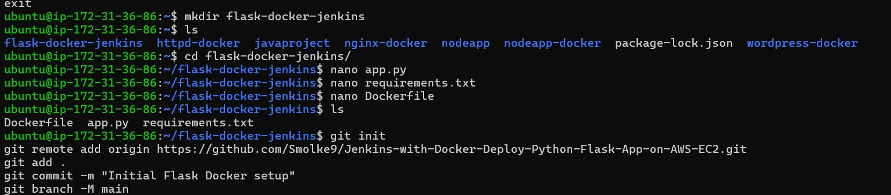
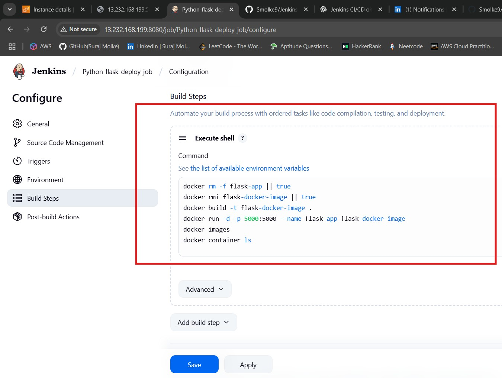
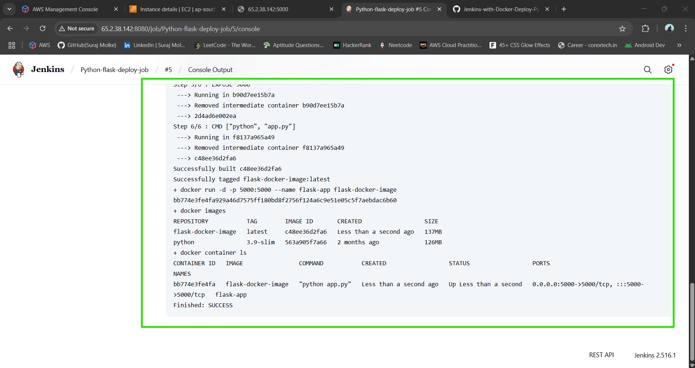
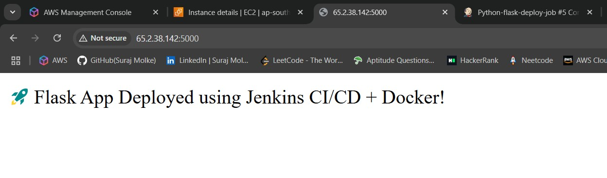

# 🔧 Jenkins CI/CD with Docker – Deploy Python Flask App on AWS EC2

This guide walks you through automating the build and deployment of a Python Flask application using Jenkins, Docker, and GitHub on an AWS EC2 Ubuntu instance using a Freestyle job.

---

## ✅ Prerequisites

- AWS EC2 Ubuntu instance (22.04 or later)
- Jenkins and Docker installed
- GitHub account with a Flask project repo
- Open ports: 22 (SSH), 5000 (Flask), 8080 (Jenkins)

---

## 📁 Project Structure

```
flask-docker-jenkins/
├── app.py
├── requirements.txt
└── Dockerfile
```

### `app.py`
```python
from flask import Flask
app = Flask(__name__)

@app.route("/")
def hello():
    return "🚀 Flask App Deployed using Jenkins CI/CD + Docker!"

if __name__ == "__main__":
    app.run(host="0.0.0.0", port=5000)
```

### `requirements.txt`
```
flask
```

### `Dockerfile`
```Dockerfile
FROM python:3.9-slim
WORKDIR /app
COPY . .
RUN pip install -r requirements.txt
EXPOSE 5000
CMD ["python", "app.py"]
```

---

## 🚀 Step-by-Step Setup

### STEP 1: Launch EC2 and Connect

- Launch EC2 Ubuntu instance
- Open inbound rules: 22, 5000, 8080
- Connect:

```bash
ssh -i "your-key.pem" ubuntu@<EC2_PUBLIC_IP>
```

---

### STEP 2: Install Docker and Jenkins

```bash
sudo apt update && sudo apt upgrade -y
sudo apt install docker.io git -y
sudo usermod -aG docker $USER
newgrp docker

# Install Jenkins
sudo apt install openjdk-17-jre -y
wget -q -O - https://pkg.jenkins.io/debian/jenkins.io.key | sudo apt-key add -
sudo sh -c 'echo deb http://pkg.jenkins.io/debian-stable binary/ > /etc/apt/sources.list.d/jenkins.list'
sudo apt update
sudo apt install jenkins -y
sudo systemctl start jenkins
sudo systemctl enable jenkins
sudo usermod -aG docker jenkins
sudo systemctl restart jenkins
```

---

### STEP 3: Push Flask App to GitHub

```bash
git init
git remote add origin https://github.com/Smolke9/Jenkins-with-Docker-Deploy-Python-Flask-App-on-AWS-EC2.git
git add .
git commit -m "Initial Flask Docker setup"
git branch -M main
git push -u origin main
```

---

### STEP 4: Configure Jenkins Freestyle Job

1. Jenkins Dashboard → New Item → `flask-deploy-job` → Freestyle project
2. Enable GitHub Project: `https://github.com/Smolke9/Jenkins-with-Docker-Deploy-Python-Flask-App-on-AWS-EC2.git`
3. Source Code Management → Git → Enter repo URL
4. Build Trigger → ✅ GitHub hook trigger for GITScm polling
5. Build → Execute Shell:

```bash
docker rm -f flask-app || true
docker rmi flask-docker-image || true
docker build -t flask-docker-image .
docker run -d -p 5000:5000 --name flask-app flask-docker-image
```

---

### STEP 5: Configure GitHub Webhook

- GitHub → Repo → Settings → Webhooks → Add Webhook
  - Payload URL: `http://<EC2_PUBLIC_IP>:8080/github-webhook/`
  - Content type: `application/json`
  - Events: Push

---

### STEP 6: Test Deployment

1. Push any update to GitHub or click **Build Now** in Jenkins


   
3. Visit: `http://<EC2_PUBLIC_IP>:5000`

---

## 🎉 Done!

You now have a Flask app deployed automatically with each GitHub push via Jenkins, Docker, and EC2.

---

© 2025 | Flask Jenkins CI/CD Demo
